# 心理学导论：理解心智与行为的科学

> **教程说明**：本教程涵盖心理学七大核心领域，从基础理论到现代应用，帮助你系统理解人类心智与行为的科学。每个章节包含关键概念、经典实验、Mermaid 图表和思考练习。

---

## 第一章：心理学导论与历史发展

### 1.1 什么是心理学？

**心理学（Psychology）** 是研究**行为**和**心理过程**的科学。它试图回答三个核心问题：

| 问题 | 说明 | 举例 |
|------|------|------|
| **我们做什么？** | 描述可观察的行为 | "这个人在压力下会发脾气" |
| **我们想什么/感受什么？** | 研究内部心理过程 | "压力引发焦虑和愤怒情绪" |
| **为什么这样做/想？** | 解释行为和心理过程的原因 | "因为童年经验塑造了这种应对模式" |

#### 心理学的四大目标

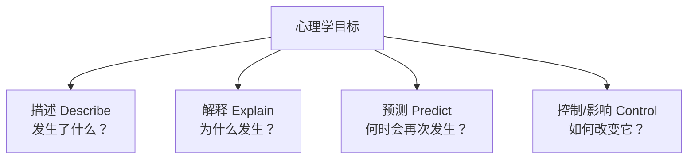

| 目标 | 说明 | 举例 |
|------|------|------|
| **描述** | 客观记录行为和心理现象 | "青少年平均每天使用手机4.5小时" |
| **解释** | 理解现象背后的原因 | "手机使用与社交需求、即时奖励机制有关" |
| **预测** | 预判未来行为趋势 | "每天使用手机超过6小时的青少年抑郁风险增加40%" |
| **控制/影响** | 运用知识改善生活 | "设计数字健康干预方案减少过度使用" |

#### 心理学的分支

| 领域 | 关注点 | 举例 |
|------|--------|------|
| **临床心理学** | 评估和治疗心理障碍 | 抑郁症的认知行为治疗 |
| **认知心理学** | 研究思维、记忆、语言等心理过程 | 工作记忆容量研究 |
| **发展心理学** | 研究生命全程的心理变化 | 儿童语言习得过程 |
| **社会心理学** | 研究个体在社会环境中的行为 | 从众行为的影响因素 |
| **生物心理学** | 研究行为的生物学基础 | 大脑损伤对人格的影响 |
| **工业/组织心理学** | 将心理学应用于工作场所 | 员工动机与绩效关系 |

### 1.2 心理学的历史根源

心理学作为一门独立科学的历史并不长，但其思想根源可以追溯到古代哲学。

#### 哲学根源

| 时期 | 思想家 | 贡献 |
|------|--------|------|
| **古希腊** | 柏拉图 | 提出心智与身体分离（二元论） |
| **古希腊** | 亚里士多德 | 主张知识来源于经验（经验主义先驱） |
| **17世纪** | 笛卡尔 | 身心互动理论，提出反射概念 |
| **17世纪** | 洛克 | "白板说"——心灵最初是空白的，由经验填充 |
| **19世纪** | 赫尔姆霍茨 | 测量神经冲动传导速度，为实验心理学奠基 |

#### 关键争论：先天 vs 后天

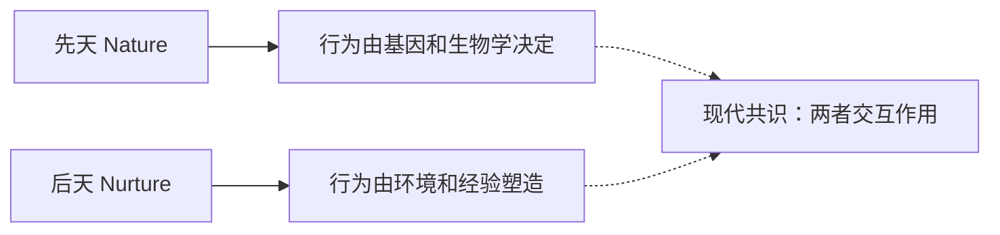

> **现代观点**：几乎所有心理特征都是**基因与环境交互作用**的结果。问题不再是"哪个更重要"，而是"它们如何共同作用"。

### 1.3 心理学的早期学派

#### 结构主义（Structuralism）

**创始人**：威廉·冯特（Wilhelm Wundt），1879年在德国莱比锡大学建立第一个心理学实验室，标志着**心理学作为独立科学的诞生**。

| 要点 | 说明 |
|------|------|
| **核心主张** | 意识可以分解为基本元素（感觉、意象、情感） |
| **研究方法** | **内省法（Introspection）**——训练有素的被试报告自己的意识经验 |
| **代表人物** | 冯特、铁钦纳（Titchener） |
| **贡献** | 确立了实验心理学的地位 |
| **局限** | 内省法主观性强，不同实验室结果不一致 |

#### 机能主义（Functionalism）

**代表人物**：威廉·詹姆斯（William James），美国心理学之父，《心理学原理》（1890）作者。

| 要点 | 说明 |
|------|------|
| **核心主张** | 关注意识的**功能**而非结构——意识如何帮助人类适应环境 |
| **影响来源** | 达尔文的进化论 |
| **贡献** | 拓宽了心理学研究范围，包括儿童、动物、个体差异 |
| **经典比喻** | 意识像一条"河流"（意识流），持续流动、不可分割 |

#### 格式塔心理学（Gestalt Psychology）

**代表人物**：韦特海默（Wertheimer）、苛勒（Köhler）、考夫卡（Koffka）

| 要点 | 说明 |
|------|------|
| **核心主张** | **"整体大于部分之和"**——知觉不是感觉元素的简单叠加 |
| **经典例子** | 电影画面由静态帧组成，但我们看到的是连续运动（似动现象） |
| **贡献** | 对知觉研究的深远影响，启发了认知心理学 |

### 1.4 二十世纪的三大势力

#### 第一势力：精神分析（Psychoanalysis）

**创始人**：西格蒙德·弗洛伊德（Sigmund Freud）

| 要点 | 说明 |
|------|------|
| **核心主张** | 行为受**潜意识**中的性本能和攻击本能驱动 |
| **关键概念** | 潜意识、本我/自我/超我、防御机制、心理性发展阶段 |
| **研究方法** | 自由联想、梦的解析、临床个案 |
| **贡献** | 首次系统探讨潜意识对行为的影响，深刻影响文化和艺术 |
| **批评** | 缺乏科学验证、过度强调性、样本代表性不足 |

#### 第二势力：行为主义（Behaviorism）

**代表人物**：华生（John B. Watson）、斯金纳（B.F. Skinner）、巴甫洛夫（Ivan Pavlov）

| 要点 | 说明 |
|------|------|
| **核心主张** | 心理学应该只研究**可观察的行为**，拒绝研究意识 |
| **关键概念** | 经典条件反射、操作性条件反射、强化、惩罚 |
| **经典实验** | 华生的"小阿尔伯特"实验、斯金纳箱 |
| **贡献** | 建立了严格的实验方法，行为治疗至今有效 |
| **批评** | 忽视认知过程、将人简化为刺激-反应机器 |

> **华生的著名宣言**："给我一打健康的婴儿，我可以把他们训练成任何类型的专家——医生、律师、艺术家，甚至是小偷或乞丐。"

#### 第三势力：人本主义（Humanism）

**代表人物**：马斯洛（Abraham Maslow）、罗杰斯（Carl Rogers）

| 要点 | 说明 |
|------|------|
| **核心主张** | 人天生有**自我实现**的倾向，强调自由意志和积极潜能 |
| **关键概念** | 需求层次、无条件积极关注、自我概念 |
| **贡献** | 平衡了精神分析的悲观和行为主义的机械，影响教育和心理咨询 |
| **批评** | 概念模糊、难以实证检验、过于理想化 |

### 1.5 当代心理学的主要视角

现代心理学不再由单一流派主导，而是整合多种视角：

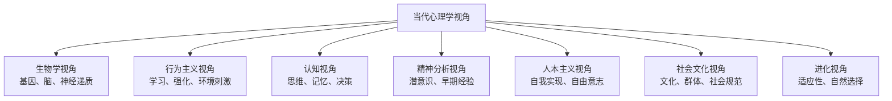

| 视角 | 关注点 | 举例：解释"攻击行为" |
|------|--------|---------------------|
| **生物学** | 大脑、基因、激素 | 杏仁核过度活跃、睾酮水平高 |
| **行为主义** | 强化历史 | 过去攻击行为获得了奖励 |
| **认知** | 思维模式 | 将他人行为解读为敌意 |
| **精神分析** | 潜意识冲突 | 压抑的愤怒被转移到他人身上 |
| **人本主义** | 自我概念威胁 | 自尊受到挑战时的防御反应 |
| **社会文化** | 社会规范 | 某些文化更容忍攻击行为 |
| **进化** | 适应性价值 | 攻击行为在进化中有资源竞争价值 |

### 1.6 心理学 vs 伪心理学

科学心理学与伪心理学的关键区别在于**是否接受实证检验**。

| 伪心理学 | 说明 | 为什么不可信 |
|---------|------|-------------|
| **占星术** | 根据星座预测人格和命运 | 大量研究表明星座与人格无关联 |
| **手相学** | 通过手掌纹路预测未来 | 缺乏可重复的实证证据 |
| **测谎仪** | 通过生理指标判断是否说谎 | 准确率有限，易受焦虑等因素干扰 |
| **潜意识自助录音** | 声称通过潜意识信息改变行为 | 研究显示效果等同于安慰剂 |

#### 批判性思维工具

| 原则 | 说明 |
|------|------|
| **可证伪性** | 科学理论必须能够被证明是错的 |
| **奥卡姆剃刀** | 在多个解释中，选择假设最少的那个 |
| **相关不等于因果** | 两个变量相关不代表一个导致另一个 |
| **控制组** | 没有实验处理的组，用于比较 |
| **同行评审** | 研究需经独立专家审查才能发表 |

### 本章关键概念

| 概念 | 简要定义 |
|------|---------|
| 心理学 | 研究行为和心理过程的科学 |
| 四大目标 | 描述、解释、预测、控制 |
| 结构主义 | 将意识分解为基本元素 |
| 机能主义 | 关注意识如何帮助适应环境 |
| 精神分析 | 潜意识驱动行为的理论 |
| 行为主义 | 只研究可观察的行为 |
| 人本主义 | 强调自我实现和自由意志 |
| 批判性思维 | 用证据和逻辑评估主张的能力 |

### 思考练习

1. 冯特1879年建立第一个心理学实验室为什么被认为是心理学诞生的标志？在此之前，心理学思想以什么形式存在？
2. 用当代心理学的七种视角分别解释"为什么有人会在网络上发表攻击性言论"。
3. 你生活中有哪些信念或做法可能属于"伪心理学"？如何用批判性思维来检验它们？
4. "先天 vs 后天"的争论为什么在现代心理学中不再是非此即彼的问题？请举一个具体例子说明两者的交互作用。

---

## 第二章：心理学研究方法

### 2.1 科学方法

心理学作为一门科学，依赖**科学方法（Scientific Method）**来建立知识。科学方法是一套系统化的程序，用于提出问题、收集证据和检验理论。

#### 科学方法的步骤

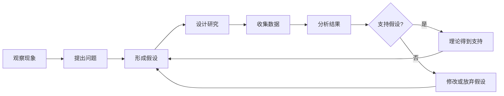

| 步骤 | 说明 | 举例 |
|------|------|------|
| **观察** | 注意有趣的现象 | "考试前很多学生睡不好" |
| **提问** | 将观察转化为研究问题 | "压力是否影响睡眠质量？" |
| **假设** | 提出可检验的预测 | "考试压力越大，入睡时间越长" |
| **研究设计** | 选择合适的方法检验假设 | 用问卷调查压力和睡眠的关系 |
| **数据收集** | 系统记录观察结果 | 收集200名学生的数据 |
| **分析** | 用统计方法处理数据 | 计算压力分数与入睡时间的相关系数 |
| **结论** | 判断假设是否得到支持 | "压力与入睡时间呈正相关" |

#### 假设的特征

一个好的假设必须：
- **可检验**：能够通过观察或实验来验证
- **可证伪**：存在被证明为错的可能性
- **具体明确**：清晰定义变量和预期关系

### 2.2 描述性研究方法

描述性研究旨在**观察和记录行为**，而不操纵变量。

#### 自然观察法（Naturalistic Observation）

在自然环境中观察和记录行为，不干预。

| 优点 | 缺点 |
|------|------|
| 行为真实自然 | 无法确定因果关系 |
| 可发现新现象 | 观察者可能影响行为（观察者效应） |
| 生态效度高 | 难以重复 |

> **经典例子**：珍妮·古道尔在坦桑尼亚自然环境中观察黑猩猩的社会行为，发现它们会使用工具——这一发现颠覆了"只有人类会使用工具"的观点。

#### 个案研究（Case Study）

对单一个体或群体进行深入、详细的考察。

| 优点 | 缺点 |
|------|------|
| 提供深度信息 | 结果可能不具代表性 |
| 研究罕见现象 | 无法推广到一般人群 |
| 产生研究假设 | 主观解释可能影响结论 |

> **经典例子**：H.M. 病例——一位因癫痫手术切除海马体的患者，丧失了形成新记忆的能力。这个个案为理解记忆的神经基础做出了巨大贡献。

#### 调查法（Survey）

通过问卷或访谈收集大量参与者的自我报告数据。

| 优点 | 缺点 |
|------|------|
| 快速收集大量数据 | 自我报告可能不准确 |
| 成本较低 | 样本可能不具代表性 |
| 可研究敏感话题 | 社会期望偏差（给出"正确"答案） |

> **抽样关键**：**随机抽样（Random Sampling）**确保总体中每个成员都有同等机会被选中，结果才能推广到总体。

### 2.3 相关研究

**相关研究（Correlational Research）** 测量两个变量之间的关系程度，但不操纵变量。

#### 相关系数（Correlation Coefficient）

用 **r** 表示，范围从 **-1.0 到 +1.0**：

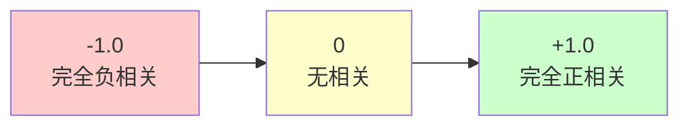

| 相关类型 | r 值 | 说明 | 举例 |
|---------|------|------|------|
| **正相关** | 0 到 +1.0 | 一个变量增加，另一个也增加 | 学习时间与考试成绩 |
| **负相关** | 0 到 -1.0 | 一个变量增加，另一个减少 | 练习次数与错误率 |
| **无相关** | 接近 0 | 两个变量之间没有系统性关系 | 鞋码与智商 |

#### ⚠️ 相关 ≠ 因果

这是心理学中最重要也最常被误解的原则。

| 相关发现 | 可能的因果解释 |
|---------|--------------|
| "冰淇淋销量与溺水率正相关" | 第三个变量：夏天（天气热→更多人买冰淇淋，更多人游泳） |
| "自尊与学业成绩正相关" | 可能是学业成绩提高了自尊，也可能是高自尊促进了学业，也可能是家庭环境同时影响两者 |
| "社交媒体使用与抑郁相关" | 可能是社交媒体导致抑郁，也可能是抑郁的人更多使用社交媒体，也可能有其他原因 |

> **第三变量问题**：两个变量之间的相关可能是由未被测量的第三个变量引起的。

### 2.4 变量与操作定义

#### 变量类型

| 变量类型 | 定义 | 举例 |
|---------|------|------|
| **自变量（IV）** | 研究者操纵的变量 | 咖啡因剂量（0mg vs 200mg） |
| **因变量（DV）** | 研究者测量的变量 | 注意力测试得分 |
| **控制变量** | 保持不变的变量 | 测试时间、环境温度 |
| **混淆变量** | 未被控制但可能影响结果的变量 | 参与者的睡眠状况 |

#### 操作定义（Operational Definition）

用**可测量、可观察**的方式定义抽象概念。

| 抽象概念 | 操作定义举例 |
|---------|-------------|
| "攻击性" | 在10分钟观察期内对同伴的身体攻击次数 |
| "幸福感" | 生活满意度量表的总分 |
| "学习动机" | 每周自主学习的小时数 |
| "压力" | 唾液中的皮质醇浓度 |
### 2.5 实验法

**实验法（Experimental Method）** 是唯一能确定**因果关系**的研究方法。

#### 实验的核心要素

| 要素 | 说明 | 举例 |
|------|------|------|
| **自变量** | 研究者有意操纵的变量 | 睡眠时间（4小时 vs 8小时） |
| **因变量** | 研究者测量的结果变量 | 记忆力测试得分 |
| **实验组** | 接受实验处理的组 | 只睡4小时的组 |
| **控制组** | 不接受处理或接受标准处理的组 | 正常睡8小时 |
| **随机分配** | 每个参与者有同等机会被分到任何一组 | 用随机数表分配 |
| **混淆变量** | 可能影响结果但未被控制的变量 | 年龄、咖啡因摄入、压力水平 |

#### 实验设计示例

**研究问题**：咖啡因是否提高注意力？

```
实验设计：
参与者 (N=100) -> 随机分配 -> 实验组(n=50, 含咖啡因200mg) / 控制组(n=50, 安慰剂)
-> 30分钟后进行注意力测试 -> 测量反应时间和正确率
```

#### 双盲设计（Double-Blind Design）

为了排除**期望效应**（参与者或研究者的期望影响结果），最严格的实验采用双盲设计：
- **参与者**不知道自己属于实验组还是控制组
- **研究者**也不知道哪个参与者属于哪一组

> **安慰剂效应**：即使服用的是没有药效的"糖丸"，只要患者相信它是有效的，症状也可能改善。这是医学和心理学研究中必须控制的重要因素。

### 2.6 研究伦理

心理学研究涉及人类（和动物）参与者，必须遵循严格的伦理准则。

#### 核心伦理原则

| 原则 | 说明 |
|------|------|
| **知情同意** | 参与者必须在充分了解研究内容后自愿参加 |
| **保护免受伤害** | 研究不应给参与者造成身体或心理伤害 |
| **保密** | 参与者的个人信息和数据必须保密 |
| **事后解释（Debriefing）** | 研究结束后向参与者说明研究的真实目的 |
| **自愿参与** | 参与者可以随时退出研究，不受任何惩罚 |

#### 历史上著名的伦理争议

- **米尔格拉姆服从实验（1963）**：参与者被要求对"学习者"施加电击（实际是假的），65%的人服从指令施加了最高电压。引发了关于"研究是否对参与者造成心理伤害"的广泛讨论。
- **斯坦福监狱实验（1971）**：大学生被随机分配为"狱警"和"囚犯"，实验因"狱警"的虐待行为在6天后被迫终止（原计划2周）。

### 2.7 定量研究与定性研究

| 维度 | 定量研究 | 定性研究 |
|------|---------|---------|
| **数据类型** | 数字、统计 | 文字、描述 |
| **目标** | 检验假设、发现规律 | 理解意义、深入探索 |
| **方法** | 实验、调查、心理测量 | 深度访谈、焦点小组、民族志 |
| **样本** | 大样本、随机抽样 | 小样本、目的性抽样 |
| **分析** | 统计分析 | 主题分析、内容分析 |
| **举例** | "抑郁症患者的血清素水平比对照组低23%" | "抑郁症患者描述他们的日常体验为'像在浓雾中行走'" |

### 本章关键概念

| 概念 | 简要定义 |
|------|---------|
| 假设 | 可检验的预测 |
| 自变量 | 研究者操纵的变量 |
| 因变量 | 研究者测量的变量 |
| 随机分配 | 参与者被随机分到不同实验条件 |
| 相关系数 | 衡量两个变量关系强度和方向的指标 |
| 双盲设计 | 参与者和研究者都不知道分组情况 |
| 安慰剂效应 | 因期望而产生的效果 |
| 知情同意 | 参与者在了解研究后自愿参加 |

### 思考练习

1. 为什么说"相关不等于因果"？请举一个生活中的例子说明。
2. 如果要研究"手机使用是否影响青少年睡眠质量"，你会如何设计实验？指出自变量、因变量和控制变量。
3. 米尔格拉姆实验违反了哪些现代研究伦理原则？这个研究的价值是否足以弥补伦理问题？
4. 定量研究和定性研究各有什么优势和局限？在什么情况下你会选择其中一种？

---

## 第三章：生物心理学与神经基础

### 3.1 心智的生物学基础

心理学的核心问题之一是：**心理过程如何从大脑中产生？** 生物心理学（Biological Psychology）研究行为和心理过程的生物学基础，特别是神经系统的作用。

### 3.2 神经元：神经系统的基本单位

**神经元（Neuron）** 是神经系统的基本功能单位。人脑约有 **860亿个神经元**。

#### 神经元结构


| 结构 | 功能 |
|------|------|
| **树突** | 接收来自其他神经元的信息 |
| **细胞体（胞体）** | 整合传入信号，决定是否发放神经冲动 |
| **轴突** | 将神经冲动从细胞体传递到轴突末梢 |
| **髓鞘** | 包裹轴突的脂肪层，加速神经冲动传导 |
| **轴突末梢** | 释放神经递质到突触间隙 |

#### 神经冲动的传递

1. **动作电位（Action Potential）**：当神经元接收到的刺激超过某个阈值时，会产生一个全或无（all-or-none）的电信号，沿轴突传播
2. **突触传递（Synaptic Transmission）**：电信号到达轴突末梢后，触发**神经递质**释放到突触间隙
3. **神经递质与受体结合**：神经递质像钥匙一样与下一个神经元树突上的受体（锁）结合，引发新的电信号

> **类比**：神经元之间的信息传递就像接力赛。动作电位是跑步选手，跑到终点（轴突末梢）后将接力棒（神经递质）交给下一棒的选手（下一个神经元）。

### 3.3 主要神经递质及其心理功能

| 神经递质 | 主要功能 | 相关疾病/现象 |
|---------|---------|-------------|
| **多巴胺（Dopamine）** | 奖励、动机、运动控制 | 帕金森病（不足）、精神分裂症（过量） |
| **血清素（Serotonin）** | 情绪调节、睡眠、食欲 | 抑郁症（不足）、强迫症 |
| **去甲肾上腺素（Norepinephrine）** | 警觉、唤醒、应激反应 | 焦虑症、PTSD |
| **GABA** | 主要抑制性递质，降低神经元兴奋性 | 焦虑症（不足）、癫痫 |
| **谷氨酸（Glutamate）** | 主要兴奋性递质，学习与记忆 | 阿尔茨海默病 |
| **乙酰胆碱（Acetylcholine）** | 肌肉运动、学习、记忆 | 阿尔茨海默病（不足） |
| **内啡肽（Endorphins）** | 天然止痛药，产生愉悦感 | 运动后的"跑步者高潮" |

> **现实联系**：大多数抗抑郁药（如百忧解 Prozac）通过增加突触间隙中的血清素浓度来改善情绪。这解释了为什么调节化学物质可以改变心理状态。

### 3.4 神经系统的组织

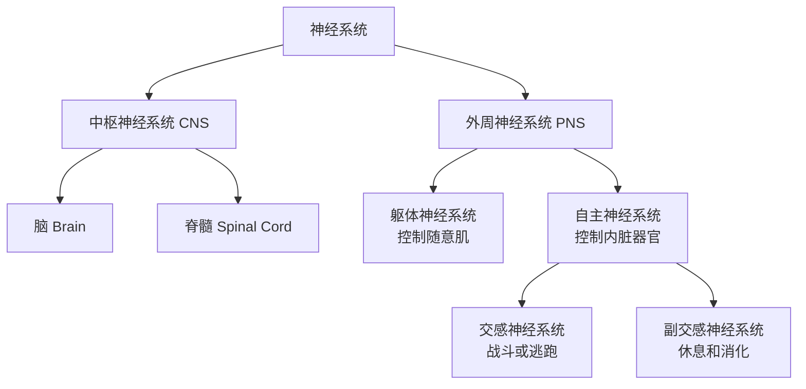

#### 自主神经系统：身体的"油门"和"刹车"

| 系统 | 功能 | 激活时的表现 |
|------|------|-------------|
| **交感神经系统** | 动员身体应对紧急情况 | 心跳加速、瞳孔放大、消化减慢、出汗 |
| **副交感神经系统** | 使身体恢复平静 | 心跳减慢、消化恢复、瞳孔缩小 |

> **举例**：当你突然看到一条蛇时，交感神经系统立即激活——心跳加快、肌肉紧张，准备逃跑。确认是根绳子后，副交感神经系统启动，身体逐渐恢复平静。

### 3.5 脑的结构与功能

人脑可以分为几个主要区域，每个区域负责不同的功能。

#### 脑干（Brainstem）

- **延髓**：控制心跳、呼吸等基本生命功能
- **脑桥**：协调身体运动，参与睡眠
- **网状结构**：控制觉醒和注意

> **损伤后果**：脑干严重损伤可导致昏迷或死亡，因为它控制着维持生命的基本功能。

#### 小脑（Cerebellum）

- 协调随意运动
- 维持平衡和姿势
- 参与程序性记忆（如骑自行车）

#### 边缘系统（Limbic System）

与情绪、动机和记忆密切相关的一组结构：

| 结构 | 功能 |
|------|------|
| **杏仁核（Amygdala）** | 恐惧和攻击行为的核心；情绪记忆 |
| **海马体（Hippocampus）** | 形成新的陈述性记忆；空间导航 |
| **下丘脑（Hypothalamus）** | 调节体温、饥饿、口渴、性行为；控制垂体 |
| **丘脑（Thalamus）** | 感觉信息的中继站 |

#### 大脑皮层（Cerebral Cortex）

大脑皮层是大脑最外层的高度折叠的灰质层，是**高级心理过程**的所在地。

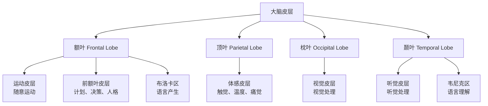

| 脑叶 | 主要功能 | 损伤表现 |
|------|---------|---------|
| **额叶** | 运动控制、计划、决策、人格、语言表达 | 人格改变、冲动控制障碍、语言产生困难 |
| **顶叶** | 体感处理、空间感知 | 无法感知身体一侧、空间定向障碍 |
| **枕叶** | 视觉处理 | 视觉缺陷、视觉失认 |
| **颞叶** | 听觉处理、语言理解、记忆 | 听觉障碍、语言理解困难、记忆问题 |

#### 大脑半球与胼胝体

- **左半球**：通常主导语言、逻辑分析、数学
- **右半球**：通常主导空间能力、面孔识别、情绪加工
- **胼胝体（Corpus Callosum）**：连接两个半球的神经纤维束，使它们能够通信

> **裂脑研究**：当胼胝体被切断（治疗严重癫痫的手术），两个半球独立工作。研究者可以向每个半球单独呈现信息，揭示了两半球的不同专长。

### 3.6 研究大脑的技术

| 技术 | 原理 | 用途 |
|------|------|------|
| **EEG（脑电图）** | 记录头皮上的电活动 | 研究脑波、睡眠、癫痫 |
| **fMRI（功能性磁共振成像）** | 检测血氧变化反映脑区活动 | 定位特定任务激活的脑区 |
| **PET（正电子发射断层扫描）** | 追踪放射性示踪剂的代谢 | 研究脑代谢、神经递质系统 |
| **CT（计算机断层扫描）** | X射线三维成像 | 检测脑结构异常、肿瘤 |

### 3.7 遗传与行为

**行为遗传学（Behavioral Genetics）** 研究基因对行为的影响。

- **双生子研究**：比较同卵双胞胎（100%基因相同）和异卵双胞胎（50%基因相同）的相似性，估计遗传贡献
- **收养研究**：比较被收养儿童与生物学父母和养父母的相似性
- **全基因组关联研究（GWAS）**：扫描大量个体的基因组，寻找与特定行为或疾病相关的基因变异

> **重要概念**：**遗传率（Heritability）** 描述的是群体中某一特征的变异有多少可以归因于基因差异，**不是**指个体特征的"遗传百分比"。例如，身高的遗传率约为0.8，意味着人群中身高差异的80%可归因于基因差异。

### 本章关键概念

| 概念 | 简要定义 |
|------|---------|
| 神经元 | 神经系统的基本功能单位 |
| 动作电位 | 沿轴突传播的全或无的电信号 |
| 神经递质 | 在突触间传递信息的化学物质 |
| 突触 | 两个神经元之间的连接点 |
| 交感神经系统 | 动员身体应对紧急情况的"油门" |
| 副交感神经系统 | 使身体恢复平静的"刹车" |
| 杏仁核 | 恐惧和情绪加工的核心脑区 |
| 海马体 | 形成新记忆的关键脑区 |
| 大脑皮层 | 高级心理过程的所在地 |
| 遗传率 | 群体中特征变异可归因于基因的比例 |

### 思考练习

1. 如果一个人的海马体受损，你预期他在哪些心理功能上会出现困难？为什么？
2. 当你突然听到一声巨响时，你的自主神经系统会如何反应？请描述交感和副交感神经系统的变化过程。
3. 多巴胺与奖励系统有关。你能想到哪些日常行为与多巴胺释放相关？这如何解释成瘾行为？
4. "左脑人"和"右脑人"的说法流行于大众文化，但科学上准确吗？请解释。
---

## 第四章：感觉与知觉

### 4.1 感觉 vs 知觉

虽然这两个词经常被混用，但它们在心理学中有明确的区分：

| 概念 | 定义 | 举例 |
|------|------|------|
| **感觉（Sensation）** | 感受器接收物理刺激并转化为神经信号的过程 | 视网膜上的光感受器检测到光线 |
| **知觉（Perception）** | 大脑组织、解释感觉信息并赋予其意义的过程 | 将光线模式识别为"一张人脸" |


> **简单理解**：感觉是"硬件"——眼睛接收到光信号；知觉是"软件"——大脑把这些信号解释为"这是一本书"。

### 4.2 感觉的阈限

#### 绝对阈限（Absolute Threshold）

能够被检测到的**最小刺激强度**。

| 感觉 | 绝对阈限举例 |
|------|-------------|
| 视觉 | 在晴朗的夜晚，从30英里外看到一支蜡烛的火焰 |
| 听觉 | 在安静的房间里，听到20英尺外手表的滴答声 |
| 味觉 | 在两加仑水中检测出一茶匙的糖 |
| 嗅觉 | 在三个房间的面积上扩散的一滴香水 |
| 触觉 | 从一厘米高度落在脸颊上的苍蝇翅膀 |

#### 差别阈限 / 最小可觉差（Difference Threshold / JND）

能够被察觉的**两个刺激之间的最小差异**。

**韦伯定律（Weber's Law）**：差别阈限与原始刺激强度成正比。刺激越强，需要更大的变化才能被察觉。

> **举例**：如果你拿着100克的物体，需要增加2克才能察觉到差异（JND=2克）。但如果你拿着1公斤的物体，可能需要增加20克才能察觉。

#### 信号检测论（Signal Detection Theory）

检测信号不仅取决于感觉敏感度，还取决于**决策标准**和**动机**。

| 结果 | 信号存在 | 信号不存在 |
|------|---------|-----------|
| **报告"有"** | 命中（Hit） | 虚报（False Alarm） |
| **报告"无"** | 漏报（Miss） | 正确拒绝（Correct Rejection） |

> **应用**：放射科医生看X光片寻找肿瘤时，如果标准太宽松（倾向于报告"有"），会减少漏报但增加虚报；如果标准太严格（倾向于报告"无"），会减少虚报但增加漏报。

### 4.3 感觉适应

**感觉适应（Sensory Adaptation）**：感受器对持续不变的刺激反应逐渐减弱的过程。

| 例子 | 说明 |
|------|------|
| 进入有异味的房间，几分钟后闻不到了 | 嗅觉感受器适应了持续的气味刺激 |
| 戴上手表后很快感觉不到它的存在 | 触觉感受器适应了持续的压力 |
| 从明亮处进入暗室，开始什么也看不见，逐渐能看清 | 暗适应——视觉感受器增加敏感度 |

> **意义**：感觉适应让我们忽略不变的信息，将注意力集中在**变化**的刺激上——这些变化往往更重要。

### 4.4 视觉

视觉是人类最重要的感觉通道。大脑皮层约 **30%** 的区域参与视觉处理。

#### 眼睛的结构

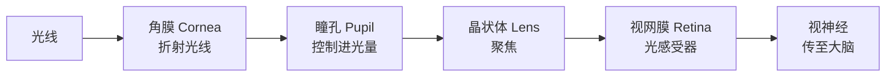

#### 视网膜上的两种光感受器

| 特征 | 视锥细胞（Cones） | 视杆细胞（Rods） |
|------|------------------|-----------------|
| **功能** | 颜色视觉、细节 | 暗视觉、运动检测 |
| **敏感度** | 低（需要强光） | 高（在弱光下工作） |
| **数量** | 约600万 | 约1.2亿 |
| **分布** | 集中在中央凹（fovea） | 分布在视网膜周边 |
| **颜色** | 三种（红、绿、蓝） | 无色 |

#### 颜色视觉理论

| 理论 | 核心观点 | 解释的现象 |
|------|---------|-----------|
| **三色说（Trichromatic Theory）** | 视网膜有三种视锥细胞，分别对红、绿、蓝光敏感 | 颜色混合原理 |
| **对立过程理论（Opponent-Process Theory）** | 颜色以对立对的方式加工：红-绿、蓝-黄、黑-白 | 负后像（盯着红色看后看白色表面会出现绿色） |

> **两种理论都是正确的**：三色说描述视网膜水平的颜色编码，对立过程理论描述视网膜之后神经节细胞和大脑的颜色加工。

### 4.5 听觉

#### 声音的物理属性

| 属性 | 物理维度 | 心理感受 | 单位 |
|------|---------|---------|------|
| **振幅** | 声波的强度 | 响度（Loudness） | 分贝（dB） |
| **频率** | 每秒振动次数 | 音高（Pitch） | 赫兹（Hz） |
| **波形** | 声波的复杂程度 | 音色（Timbre） | - |

#### 耳朵的结构

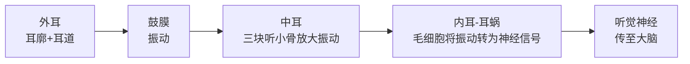

> **听力保护**：长期暴露在85分贝以上的环境中会造成永久性听力损伤。摇滚音乐会可达120分贝，耳机最大音量可达105分贝。

### 4.6 其他感觉

#### 嗅觉（Olfaction）

- 唯一不经过丘脑直接投射到皮层的感觉
- 与情绪和记忆有特别紧密的联系（因为直接连接杏仁核和海马体）
- 人类可以区分约 **1万亿种** 不同的气味

#### 味觉（Gustation）

| 基本味道 | 进化意义 |
|---------|---------|
| 甜 | 能量来源（碳水化合物） |
| 咸 | 维持电解质平衡 |
| 酸 | 检测变质食物 |
| 苦 | 检测可能的毒素 |
| 鲜（Umami） | 检测蛋白质 |

#### 前庭觉与本体感觉

| 感觉 | 功能 | 器官 |
|------|------|------|
| **前庭觉** | 平衡和空间定向 | 内耳的前庭系统 |
| **本体感觉** | 感知身体各部分的位置和运动 | 肌肉和关节中的感受器 |

### 4.7 知觉组织：格式塔原则

格式塔心理学家发现，我们不是被动接收感觉信息，而是**主动组织**它。

| 原则 | 说明 | 举例 |
|------|------|------|
| **图形-背景** | 将视觉场景分为图形（焦点）和背景 | 鲁宾花瓶/人脸图 |
| **接近性** | 距离近的物体被知觉为一组 | ·· ·· 被看作两组而非四个点 |
| **相似性** | 相似的物体被知觉为一组 | ○●○● 被看作两组 |
| **连续性** | 偏好平滑连续的线条 | 交叉的两条曲线被看作两条线而非四个线段 |
| **闭合** | 填补缺失信息形成完整图形 | 看到一个不完整的圆仍知觉为圆 |
| **共同命运** | 朝同一方向运动的物体被知觉为一组 | 一群鸟一起飞被视为一个整体 |

### 4.8 深度知觉与恒常性

#### 深度知觉线索

| 类型 | 线索 | 说明 |
|------|------|------|
| **双眼线索** | 视网膜视差 | 两眼看到的图像略有不同，大脑利用差异计算距离 |
| **单眼线索** | 线性透视 | 平行线在远处汇聚 |
| | 相对大小 | 同样大小的物体，看起来小的更远 |
| | 遮挡 | 被遮挡的物体更远 |
| | 纹理梯度 | 纹理随距离变密 |

#### 知觉恒常性

即使感觉信息变化，我们仍将物体知觉为稳定的：

| 恒常性 | 说明 | 举例 |
|--------|------|------|
| **大小恒常性** | 物体距离变化时，仍知觉为同样大小 | 远处的人看起来没有变小 |
| **形状恒常性** | 观察角度变化时，仍知觉为同样形状 | 从侧面看门仍是长方形 |
| **颜色恒常性** | 光照变化时，仍知觉为同样颜色 | 白纸在黄光下仍被看作白色 |

### 本章关键概念

| 概念 | 简要定义 |
|------|---------|
| 感觉 | 感受器检测物理刺激的过程 |
| 知觉 | 大脑组织解释感觉信息的过程 |
| 绝对阈限 | 能检测到的最小刺激强度 |
| 差别阈限 | 能察觉的最小刺激差异 |
| 感觉适应 | 对持续刺激的反应减弱 |
| 视锥细胞 | 负责颜色视觉和细节 |
| 视杆细胞 | 负责暗视觉 |
| 格式塔原则 | 我们主动组织感觉信息为有意义的整体 |
| 知觉恒常性 | 即使感觉信息变化，仍知觉物体为稳定 |

### 思考练习

1. 感觉和知觉的区别是什么？举一个日常例子说明感觉相同但知觉不同的情况。
2. 为什么商家在超市里放面包店的香味？这利用了什么心理学原理？
3. 格式塔原则如何被应用于平面设计或UI设计中？找一个你喜欢的App界面，分析它使用了哪些原则。
4. 如果一个人天生失明，在通过手术恢复视力后，他能立即识别物体吗？为什么？

---

## 第五章：意识状态

### 5.1 什么是意识？

**意识（Consciousness）** 指我们对自己和周围环境的觉知。它包括：
- 对外部世界的觉知（看到、听到、感受到）
- 对内部状态的觉知（想法、情感、身体感觉）
- 自我意识（知道自己正在经验这些内容）

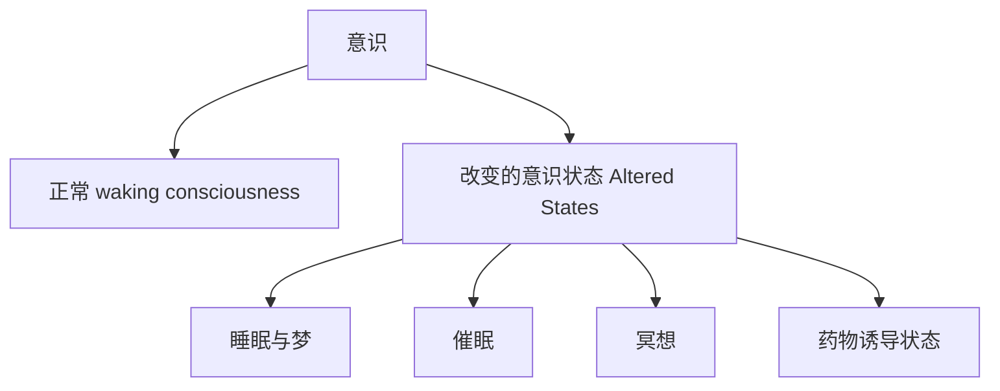

### 5.2 睡眠与梦

#### 睡眠的生物学功能

| 理论 | 说明 |
|------|------|
| **恢复理论** | 睡眠修复身体组织、巩固记忆、恢复能量 |
| **进化理论** | 睡眠减少夜间活动，降低被捕食的风险 |
| **记忆巩固** | 睡眠期间大脑处理和整合白天获取的信息 |
| **脑发育** | REM睡眠促进婴儿大脑神经连接的发育 |

#### 睡眠阶段

一个完整的睡眠周期约 **90分钟**，每晚经历 **4-6个周期**。

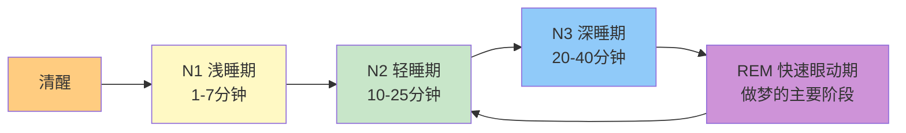

| 阶段 | 脑波 | 特征 |
|------|------|------|
| **清醒** | Beta波（快、低幅） | 警觉、活跃思维 |
| **N1 浅睡** | Theta波 | 昏昏欲睡，可能出现入睡抽动 |
| **N2 轻睡** | Theta波+睡眠纺锤波 | 心率减慢，体温下降 |
| **N3 深睡** | Delta波（慢、高幅） | 最难唤醒，生长激素分泌，身体修复 |
| **REM** | 类似清醒的脑波 | 做梦、眼球快速运动、肌肉麻痹 |

> **注意**：N1-N3 合称 **NREM（非快速眼动睡眠）**。随着夜晚进展，深睡（N3）时间减少，REM时间增加。

#### 梦的理论

| 理论 | 核心观点 | 代表人物 |
|------|---------|---------|
| **精神分析理论** | 梦是潜意识欲望的象征性满足 | 弗洛伊德 |
| **激活-合成假说** | 梦是大脑试图解释睡眠期间随机神经活动的产物 | Hobson & McCarley |
| **信息加工理论** | 梦帮助处理和巩固白天获取的信息 | 认知心理学家 |
| **神经生物学理论** | REM睡眠期间的神经活动模式产生梦的体验 | 神经科学家 |
| **威胁模拟理论** | 梦是进化遗留的"虚拟训练"，模拟危险情境 | Revonsuo |

#### 睡眠障碍

| 障碍 | 特征 | 影响 |
|------|------|------|
| **失眠（Insomnia）** | 难以入睡或维持睡眠 | 约10-15%的成年人有慢性失眠 |
| **睡眠呼吸暂停** | 睡眠中反复停止呼吸 | 日间嗜睡，增加心血管风险 |
| **嗜睡症（Narcolepsy）** | 无法控制地突然入睡 | 可能直接陷入REM睡眠 |
| **梦游（Somnambulism）** | 在深睡期行走或活动 | 常见于儿童，通常无害 |
| **夜惊** | 深睡期的极度恐惧反应 | 与噩梦不同，发生在N3期 |

### 5.3 催眠

**催眠（Hypnosis）** 是一种注意力高度集中、对外围刺激敏感性降低的意识状态。

| 要点 | 说明 |
|------|------|
| **不是睡眠** | 被催眠者脑波与清醒时相似 |
| **注意力聚焦** | 注意力集中在催眠师的指令上 |
| **暗示性增加** | 更容易接受建议，但不会做违背意愿的事 |
| **个体差异** | 约10-20%的人高度易感，20%几乎不能被催眠 |

#### 催眠的应用

- **疼痛管理**：催眠可以减少手术和分娩中的疼痛感知
- **行为改变**：戒烟、减肥、克服恐惧症
- **记忆恢复**：**争议性**——催眠可能产生虚假记忆，法庭通常不接受催眠下的证词

### 5.4 冥想

**冥想（Meditation）** 是一组训练注意力和觉知的练习。

| 类型 | 方法 | 效果 |
|------|------|------|
| **专注冥想** | 将注意力集中在呼吸、咒语或物体上 | 提高注意力和专注力 |
| **正念冥想** | 不加评判地觉知当下经验 | 减少焦虑和抑郁，改善情绪调节 |
| **慈悲冥想** | 培养对他人的善意和同情 | 增加积极情绪和亲社会行为 |

#### 冥想的神经科学证据

- 长期冥想者的**前额叶皮层**更厚（与注意和决策相关）
- 冥想减少**杏仁核**对负面情绪的反应
- 冥想增加**默认模式网络（DMN）**的调控能力，减少"走神"

### 5.5 精神活性物质

**精神活性物质（Psychoactive Drugs）** 是改变意识状态的化学物质，通过影响神经递质系统发挥作用。

#### 物质分类

| 类别 | 作用 | 举例 | 机制 |
|------|------|------|------|
| **抑制剂** | 减缓中枢神经系统活动 | 酒精、苯二氮䓬类（安定）、巴比妥类 | 增强GABA的抑制作用 |
| **兴奋剂** | 加速中枢神经系统活动 | 咖啡因、尼古丁、可卡因、安非他命 | 增加多巴胺、去甲肾上腺素 |
| **致幻剂** | 扭曲知觉和思维 | LSD、裸盖菇素（迷幻蘑菇）、麦司卡林 | 影响血清素系统 |
| **阿片类** | 止痛、产生欣快感 | 海洛因、吗啡、芬太尼 | 模拟内啡肽 |

#### 成瘾的心理学

| 概念 | 说明 |
|------|------|
| **耐受性（Tolerance）** | 需要越来越大的剂量才能达到同样效果 |
| **戒断症状（Withdrawal）** | 停止使用后出现的不适反应 |
| **身体依赖** | 身体适应了药物，需要它来维持正常功能 |
| **心理依赖** | 强烈的渴求和强迫性使用冲动 |
| **复吸** | 戒断后重新开始使用，即使在负面后果之后 |

### 本章关键概念

| 概念 | 简要定义 |
|------|---------|
| 意识 | 对自己和周围环境的觉知 |
| 昼夜节律 | 约24小时的生物周期 || REM睡眠 | 快速眼动睡眠，做梦的主要阶段 |
| 深睡期（N3） | 慢波睡眠，身体修复阶段 |
| 失眠 | 持续难以入睡或维持睡眠 |
| 催眠 | 注意力高度集中的意识状态 |
| 冥想 | 训练注意力和觉知的练习 |
| 精神活性物质 | 改变意识状态的化学物质 |
| 耐受性 | 需要越来越大的剂量才能达到同样效果 |
| 成瘾 | 强迫性使用 despite 负面后果 |

### 思考练习

1. 为什么大学生经常抱怨白天困倦？从睡眠周期和昼夜节律的角度分析原因。
2. 如果你需要备考重要考试，应该如何安排睡眠？为什么"通宵复习"是低效的？
3. 比较弗洛伊德和激活-合成假说对梦的解释，你更认同哪一种？为什么？
4. 冥想被越来越多地应用于企业和学校，你觉得这是科学有效的还是"伪科学"？说明你的理由。

---

## 第六章：学习与行为

### 6.1 什么是学习？

**学习（Learning）** 是基于经验而产生的相对持久的行为变化。

> **关键区分**：不是所有行为变化都是学习。疲劳、药物、成熟引起的变化不属于学习。学习必须是通过**经验**获得的**相对持久**的改变。

### 6.2 经典条件反射（Classical Conditioning）

由巴甫洛夫（Ivan Pavlov）发现，是最基本的学习形式之一。

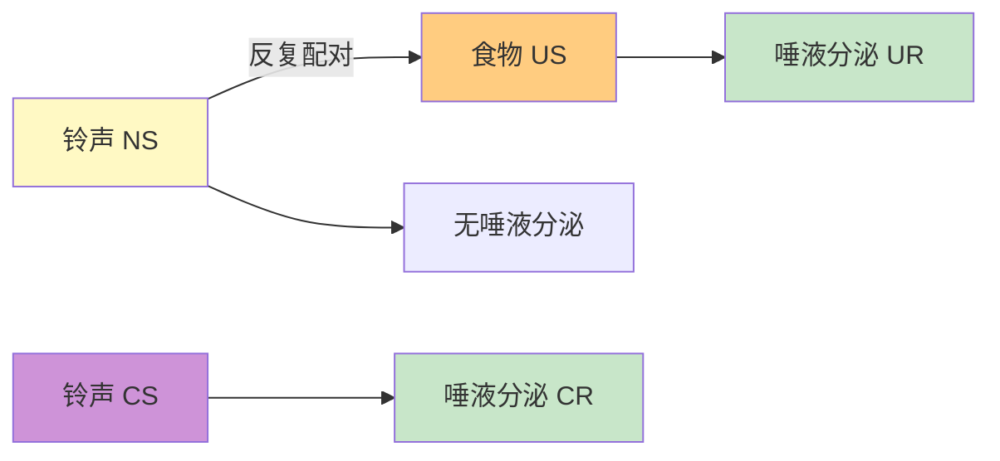

#### 核心术语

| 术语 | 英文 | 说明 | 巴甫洛夫实验 |
|------|------|------|-------------|
| **无条件刺激** | US (Unconditioned Stimulus) | 自然引发反应的刺激 | 食物 |
| **无条件反应** | UR (Unconditioned Response) | 对US的自然反应 | 唾液分泌 |
| **中性刺激** | NS (Neutral Stimulus) | 最初不引发反应的刺激 | 铃声 |
| **条件刺激** | CS (Conditioned Stimulus) | 学习后引发反应的刺激 | 铃声（配对后） |
| **条件反应** | CR (Conditioned Response) | 对CS的学习反应 | 唾液分泌 |

#### 经典条件反射的重要现象

| 现象 | 说明 | 举例 |
|------|------|------|
| **获得（Acquisition）** | CS与US反复配对，CR逐渐增强 | 铃声与食物多次配对后，铃声引起唾液分泌 |
| **消退（Extinction）** | CS反复单独出现，CR逐渐减弱 | 只响铃不给食物，唾液分泌逐渐消失 |
| **自然恢复（Spontaneous Recovery）** | 消退后经过一段时间，CR重新出现 | 消退后休息一天，再次响铃又出现唾液分泌 |
| **泛化（Generalization）** | 对类似CS的刺激也产生CR | 对类似铃声的蜂鸣声也分泌唾液 |
| **辨别（Discrimination）** | 只对特定CS产生CR | 只对特定频率的铃声分泌唾液 |

#### 现实世界的应用

| 应用 | 说明 |
|------|------|
| **恐惧症** | 小阿尔伯特实验：婴儿对白鼠的恐惧通过经典条件反射形成 |
| **广告** | 将产品（NS）与积极情感（US）配对，使产品本身引发积极情感（CR） |
| **药物耐受** | 用药环境成为CS，身体提前准备对抗药物效果，导致耐受性增加 |
| **味觉厌恶** | 一次食物中毒后，对特定食物产生长期厌恶（即使间隔数小时） |

### 6.3 操作性条件反射（Operant Conditioning）

由斯金纳（B.F. Skinner）发展，关注行为与其后果之间的关系。

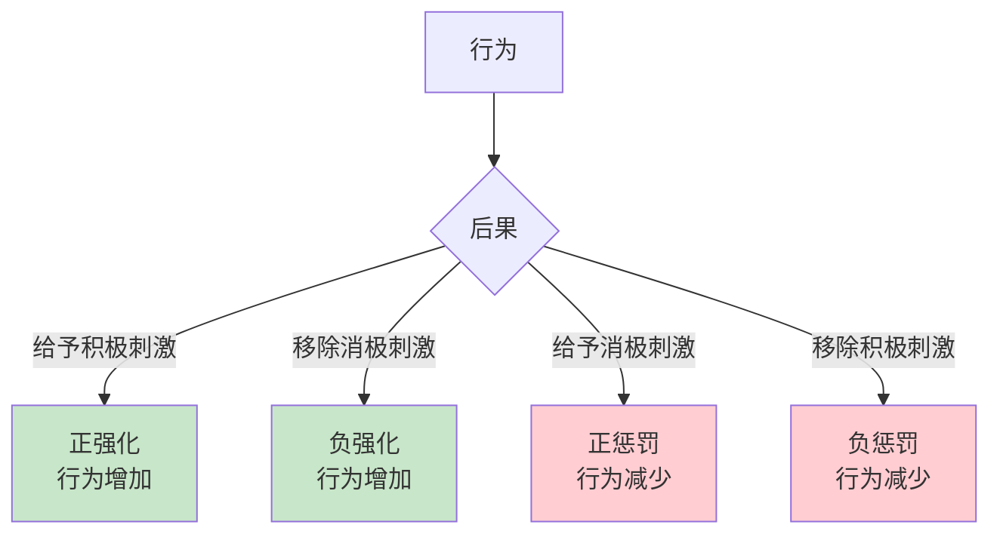

#### 强化与惩罚

| 类型 | 操作 | 效果 | 举例 |
|------|------|------|------|
| **正强化** | 给予想要的刺激 | 行为增加 | 考得好得到奖励，更努力学习 |
| **负强化** | 移除不想要的刺激 | 行为增加 | 系好安全带后烦人的提示音消失 |
| **正惩罚** | 给予不想要的刺激 | 行为减少 | 闯红灯被罚款，减少闯红灯 |
| **负惩罚** | 移除想要的刺激 | 行为减少 | 孩子捣乱被没收手机 |

> **重要区分**："正"=给予，"负"=移除；"强化"=行为增加，"惩罚"=行为减少。负强化≠惩罚！

#### 强化程序表（Schedules of Reinforcement）

| 类型 | 说明 | 举例 | 行为模式 |
|------|------|------|---------|
| **连续强化** | 每次行为都强化 | 每次按杠杆都给食物 | 学习快，消退快 |
| **固定比率（FR）** | 固定次数后强化 | 计件工资，每做10件给钱 | 高速率，强化后有停顿 |
| **可变比率（VR）** | 平均次数后强化（不确定） | 老虎机，钓鱼 | 最高速率，最抗消退 |
| **固定间隔（FI）** | 固定时间后强化 | 每周发工资，期末考试 | 强化前速率增加，之后下降 |
| **可变间隔（VI）** | 平均时间后强化（不确定） | 随机抽查，钓鱼等待 | 稳定中等速率，抗消退 |

> **关键发现**：可变比率程序产生的行为最持久、最难消退——这就是赌博成瘾的心理学基础。

#### 斯金纳的塑造（Shaping）

通过**连续逼近**的方法训练复杂行为：

1. 强化任何接近目标行为的行为
2. 逐步提高标准，只强化更接近目标的行为
3. 最终建立复杂的行为序列

> **举例**：训练鸽子转圈——先强化转头，再强化转更多，最终强化完整转圈。

### 6.4 观察学习（Observational Learning）

由班杜拉（Albert Bandura）提出，强调通过观察他人来学习。

#### 波波玩偶实验（Bobo Doll Experiment）

- 儿童观看成人对充气玩偶（Bobo doll）进行攻击行为
- 观看攻击模型的儿童随后表现出更多攻击行为
- 证明学习可以在没有直接强化的情况下发生

#### 观察学习的四个过程

| 过程 | 说明 | 举例 |
|------|------|------|
| **注意（Attention）** | 必须注意到模型的行为 | 孩子注意父母如何处理愤怒 |
| **保持（Retention）** | 必须记住观察到的行为 | 在脑海中存储行为的记忆 |
| **再现（Reproduction）** | 必须有能力执行该行为 | 有足够的运动技能模仿 |
| **动机（Motivation）** | 必须有理由去模仿 | 看到模型被奖励，更可能模仿 |

### 6.5 认知学习

#### 潜伏学习（Latent Learning）

托尔曼（Tolman）的老鼠迷宫实验证明：
- 老鼠在没有强化的情况下也能学习迷宫布局
- 学习可以在没有行为表现的情况下发生
- 引入奖励后，潜伏学习立即表现为行为改善

#### 顿悟学习（Insight Learning）

科勒（Köhler）的黑猩猩实验：
- 黑猩猩突然"理解"了如何使用工具获取食物
- 学习不是渐进的试错，而是突然的认知重组
- 顿悟后能立即解决问题并迁移到新情境

### 本章关键概念

| 概念 | 简要定义 |
|------|---------|
| 学习 | 基于经验的相对持久的行为变化 |
| 经典条件反射 | 通过刺激配对建立反射性反应 |
| 操作性条件反射 | 通过行为后果塑造自愿行为 |
| 强化 | 增加行为频率的后果 |
| 惩罚 | 减少行为频率的后果 |
| 消退 | 条件反应逐渐减弱的过程 |
| 泛化 | 对类似刺激产生相同反应 |
| 观察学习 | 通过观察他人行为进行学习 |
| 可变比率程序 | 最抗消退的强化程序 |

### 思考练习

1. 你是否有过"一朝被蛇咬，十年怕井绳"的经历？用经典条件反射的术语分析这个过程。
2. 为什么老虎机让人上瘾？用操作性条件反射的强化程序来解释。
3. 父母在教育孩子时，强化和惩罚哪个更有效？结合心理学研究说明你的观点。
4. 社交媒体（如抖音、小红书）的设计利用了哪些学习原理？分析"刷不停"背后的心理学机制。---

## 第七章：记忆

### 7.1 记忆是什么？

**记忆（Memory）** 是对信息进行编码、存储和提取的过程。它不是对过去的精确录像，而是一个**重构**的过程。

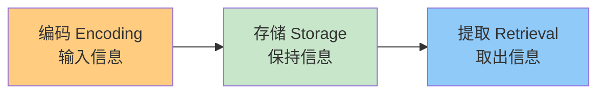

### 7.2 记忆的三级模型（Atkinson-Shiffrin Model）

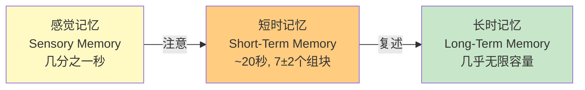

| 记忆类型 | 容量 | 持续时间 | 编码方式 | 举例 |
|---------|------|---------|---------|------|
| **感觉记忆** | 大量信息 | 视觉<1秒，听觉~4秒 | 感觉特征 | 余光扫过的场景 |
| **短时记忆/工作记忆** | 7±2个组块 | ~20秒（不复述） | 主要是听觉 | 临时记住电话号码 |
| **长时记忆** | 几乎无限 | 几分钟到终生 | 语义为主 | 你的生日、历史知识 |

#### 组块化（Chunking）

将信息组织成有意义的单元，扩大短时记忆的容量：

> **举例**：`1949100120010701` 难以记忆，但组块化为 `1949-10-01`（建国）和 `2001-07-01`（建党80周年）就容易多了。

### 7.3 长时记忆的分类

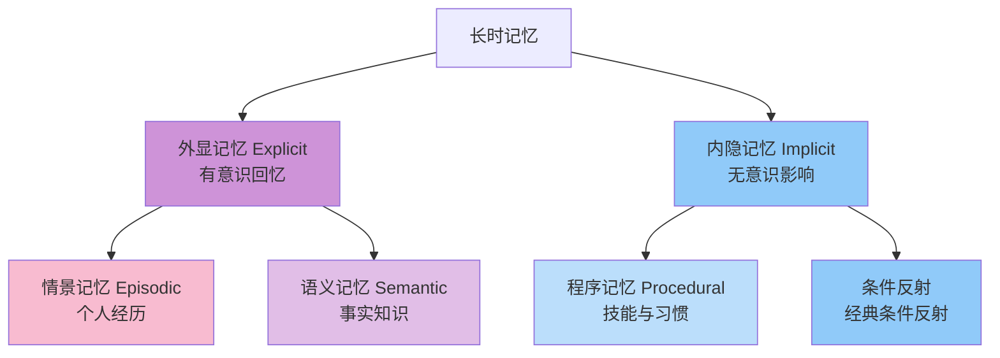

| 类型 | 内容 | 举例 | 意识参与 |
|------|------|------|---------|
| **情景记忆** | 个人经历的事件 | "我去年去了巴黎" | 有意识 |
| **语义记忆** | 一般事实知识 | "巴黎是法国的首都" | 有意识 |
| **程序记忆** | 技能和习惯 | 骑自行车、打字 | 无意识 |
| **条件反射** | 习得的自动反应 | 听到牙医钻头声紧张 | 无意识 |

### 7.4 记忆的过程

#### 编码（Encoding）

将信息转化为可以存储的形式：

| 编码类型 | 说明 | 效果 |
|---------|------|------|
| **视觉编码** | 以图像形式编码 | 记忆图像细节 |
| **听觉编码** | 以声音形式编码 | 记忆声音和韵律 |
| **语义编码** | 以意义形式编码 | **最深加工，效果最好** |

**加工水平理论（Levels of Processing）**：信息加工越深，记忆效果越好。

> **举例**：记单词"apple"
> - 浅层加工：看字体（"a"是小写吗？）→ 记忆差
> - 中等加工：听发音（押韵吗？）→ 记忆中等
> - 深层加工：想意义（是一种水果吗？）→ 记忆好

#### 存储（Storage）

保持编码的信息：

- **突触可塑性**：学习改变神经元之间的连接强度
- **长时程增强（LTP）**：反复激活的神经通路变得更敏感
- **海马体**：对新记忆的形成至关重要
- **记忆巩固**：新记忆从海马体逐渐转移到大脑皮层

#### 提取（Retrieval）

从存储中取出信息：

| 提取方式 | 说明 | 举例 | 难度 |
|---------|------|------|------|
| **回忆（Recall）** | 无需提示，从记忆中提取 | 填空题、问答题 | 较难 |
| **再认（Recognition）** | 从选项中识别正确信息 | 选择题 | 较易 |
| **再学习（Relearning）** | 重新学习已学内容的速度 | 复习旧知识更快 | 最易 |

### 7.5 为什么会遗忘？

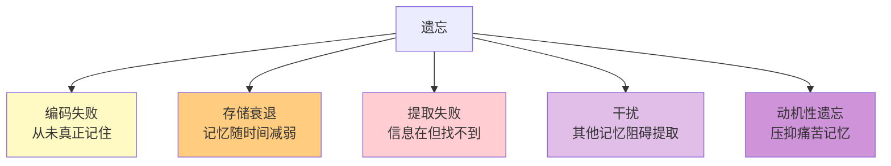

| 原因 | 说明 | 举例 |
|------|------|------|
| **编码失败** | 信息从未进入长时记忆 | 每天看硬币但画不出硬币细节 |
| **存储衰退** | 记忆痕迹随时间减弱 | 多年不用的外语逐渐忘记 |
| **提取失败** | "舌尖现象"——知道但想不起来 | 考试时突然想不起熟悉的概念 |
| **前摄干扰** | 旧记忆干扰新记忆 | 换了新密码总想起旧密码 |
| **倒摄干扰** | 新记忆干扰旧记忆 | 学了新语言后旧语言变模糊 |
| **动机性遗忘** | 潜意识压抑痛苦记忆 | 创伤事件的记忆模糊 |

### 7.6 记忆的重构性与错误记忆

**记忆不是录像回放，而是每次提取时的重新建构。**

#### 洛夫特斯（Loftus）的研究

- 目击者证词极不可靠
- 提问方式可以改变记忆："车撞碎（smashed）"比"车碰撞（hit）"让被试估计更高的车速
- 可以植入完全虚假的记忆（如童年时在商场走失）

#### 错误记忆的来源

| 来源 | 说明 |
|------|------|
| **暗示** | 他人的引导性问题改变记忆 |
| **来源混淆** | 记错了信息的来源（是自己经历还是听说的？） |
| **想象膨胀** | 反复想象某事使其感觉像真实记忆 |
| **图式影响** | 已有知识框架扭曲记忆以符合预期 |

> **法律意义**：目击者证词是冤案的主要原因之一。DNA证据已证明数百起基于目击者证词的错案。

### 7.7 如何提高记忆？

| 策略 | 说明 | 效果 |
|------|------|------|
| **间隔重复（Spaced Repetition）** | 分散学习而非集中突击 | 显著提高长期保持 |
| **提取练习（Retrieval Practice）** | 主动回忆而非被动重读 | 比反复阅读效果好50% |
| **精细加工（Elaboration）** | 将新信息与已有知识联系 | 加深编码 |
| **组织化（Organization）** | 将信息分类、建立结构 | 减少认知负荷 |
| **双重编码（Dual Coding）** | 同时使用文字和图像 | 多通道编码增强记忆 |
| **记忆术（Mnemonics）** | 首字母缩写、位置法等 | 帮助记住列表类信息 |
| **充足睡眠** | 睡眠期间记忆巩固 | 考前通宵复习得不偿失 |

### 本章关键概念

| 概念 | 简要定义 |
|------|---------|
| 编码 | 将信息转化为可存储的形式 |
| 存储 | 保持编码的信息 |
| 提取 | 从存储中取出信息 |
| 感觉记忆 | 极短暂的感觉信息保持 |
| 短时记忆 | 容量有限的临时存储 |
| 长时记忆 | 几乎永久的信息存储 |
| 外显记忆 | 有意识回忆的记忆 |
| 内隐记忆 | 无意识影响行为的记忆 |
| 遗忘曲线 | 遗忘在学习后立即快速发生 |
| 前摄干扰 | 旧记忆干扰新记忆 |
| 倒摄干扰 | 新记忆干扰旧记忆 |
| 错误记忆 | 不准确或完全虚构的记忆 |
| 间隔重复 | 分散学习提高长期保持 |

### 思考练习

1. 为什么你觉得"我明明复习了但考试就是想不起来"？从编码、存储、提取三个角度分析可能的原因。
2. 你有没有过"舌尖现象"的经历？当时是什么感觉？最后是如何想起来的？
3. 如果你是老师，你会如何设计考试来减少学生作弊？从记忆提取的角度思考。
4. "间隔重复"和"考前突击"哪个更有效？为什么大多数学生仍然选择突击？

---

## 结语：心理学的旅程

通过这七章的学习，我们已经走过了心理学的主要领域：

| 章节 | 核心问题 | 关键收获 |
|------|---------|---------|
| **第一章：导论** | 心理学是什么？ | 心理学的定义、流派、研究方法 |
| **第二章：生物基础** | 心理活动的物质基础是什么？ | 神经元、脑结构、神经系统、内分泌系统 |
| **第三章：发展与遗传** | 我们如何成为今天的自己？ | 遗传与环境、皮亚杰认知发展、依恋、道德发展 |
| **第四章：感觉与知觉** | 我们如何感知世界？ | 感觉阈限、视觉听觉、格式塔原则、知觉恒常性 |
| **第五章：意识状态** | 意识的本质是什么？ | 睡眠与梦、催眠、冥想、精神活性物质 |
| **第六章：学习** | 行为如何被塑造？ | 经典条件反射、操作性条件反射、观察学习 |
| **第七章：记忆** | 我们如何记住和遗忘？ | 记忆模型、遗忘原因、错误记忆、记忆策略 |

### 心理学的核心启示

1. **行为有原因**：每一个行为背后都有心理机制，理解这些机制让我们更宽容、更智慧。
2. **大脑可塑**：神经可塑性意味着我们终生都能学习和改变。
3. **记忆不可靠**：记忆是重构而非回放，这提醒我们保持谦逊和批判性思维。
4. **环境塑造人**：从条件反射到观察学习，环境对我们的影响远超想象。
5. **科学态度**：心理学用科学方法研究人类经验，直觉和常识常常是错的。

### 推荐延伸阅读

| 书籍 | 作者 | 适合人群 |
|------|------|---------|
| 《思考，快与慢》 | 丹尼尔·卡尼曼 | 对决策和认知偏差感兴趣的读者 |
| 《影响力》 | 罗伯特·西奥迪尼 | 对社会心理学和说服技巧感兴趣 |
| 《错把妻子当帽子》 | 奥利弗·萨克斯 | 对神经心理学案例感兴趣 |
| 《心流》 | 米哈里·契克森米哈赖 | 对积极心理学和幸福感感兴趣 |
| 《被讨厌的勇气》 | 岸见一郎 | 对阿德勒心理学感兴趣 |

### 最后的思考

> "心理学不能告诉你应该做什么，但它能告诉你，为什么你正在做你正在做的事。"

理解心理学，就是理解我们自己。希望这七章的内容能为你打开一扇门，让你用新的眼光看待自己和他人的行为。

**感谢你的学习！心理学之旅才刚刚开始。** 🧠✨